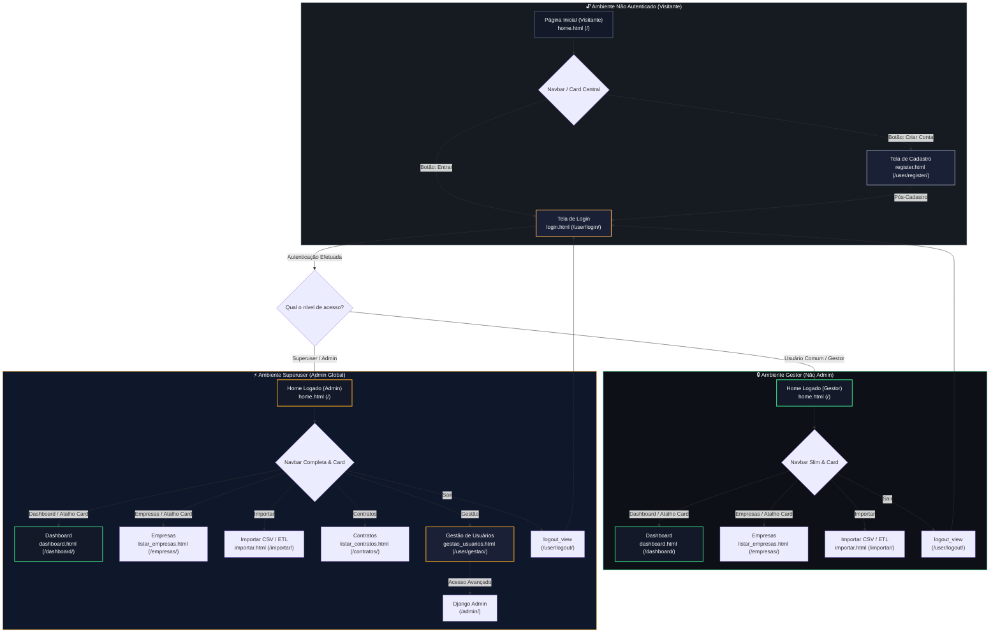

# CONVERGI

O **CONVERGI** (Convênios, Termos, Gestão e Integração) é uma plataforma inteligente desenvolvida para centralizar, gerenciar e monitorar contratos, convênios e termos institucionais no ecossistema universitário. 

Diferente de sistemas oficiais de tramitação de processos, o CONVERGI atua como uma **camada complementar de inteligência gerencial e preventiva**. Ele transforma dados brutos e registros dispersos em dashboards dinâmicos, relatórios exportáveis e alertas ativos de vencimento, otimizando o tempo das equipes administrativas e mitigando o risco de perda de prazos legais.

> **Status do Projeto:** MVP em Desenvolvimento (Base em Django) 

---

## 📌 Sumário

* [Funcionalidades](#funcionalidades)
* [Tecnologias](#tecnologias)
* [Como executar](#como-executar)
* [Padronização de dados](#padronização-de-dados)
* [Fluxos de navegação](#fluxos-de-navegação)
* [Estrutura do projeto](#estrutura-do-projeto)
* [Modelo de Sustentação e Expansão para SaaS](#modelo-de-sustentação-e-expansão-para-saas)
* [Equipe e Orientação](#-equipe-e-orientação)

---

## Funcionalidades

O MVP do CONVERGI foca estritamente nas regras de negócio e interações essenciais para validar a plataforma como uma solução preventiva superior ao controle por planilhas. A estrutura divide-se entre o que está funcional nesta versão e as delimitações de escopo estabelecidas para o ecossistema inicial.

### 🖥️ Módulos e Telas do Sistema

| Tela / Módulo | Descrição Prática | Indicadores / Elementos Chave |
| :--- | :--- | :--- |
| **Dashboard Gerencial**  | Painel dinâmico e centralizado com a visão macro do status dos instrumentos institucionais. | Total de cadastros, quantidade em vigor, vencidos e quantitativo detalhado em períodos de alerta. |
| **Consulta Rápida / Busca**  | Mecanismo de busca otimizado para localização ágil de registros sem filtros manuais complexos. | Busca por nome da empresa, CNPJ, número do contrato ou período de vigência. |
| **Alertas Ativos**  | Engine que compara a data atual do servidor com os prazos de término cadastrados. | Destaque visual cronológico para vencendo hoje, em até 7 dias e em até 14 dias. |
| **Gestão de Instrumentos**  | Formulários de CRUD para entrada de dados e manutenção dos registros internos. | Cadastro e atualização de contratos, convênios, termos e verificação de status documental. |
| **Exportação de Relatórios**  | Extração de listagens específicas de dados para suporte a tomadas de decisão urgentes. | Geração de arquivos simplificados para auditoria e planejamento administrativo. |

### 🚨 Regras do Motor de Alertas

O principal diferencial técnico da plataforma é a automação preventiva dos prazos:
* **Crítico (Vencendo Hoje):** Evidencia de forma imediata o instrumento que expira na data atual.
* **Urgente (Próximos 7 dias):** Prioriza ações administrativas que demandam providências imediatas de renovação.
* **Atenção (Próximos 14 dias):** Alerta preventivo para permitir o planejamento antecipado das equipes.

---

## Tecnologias

* **Python (v3.11+)** — Linguagem base de todo o ecossistema e inteligência do backend
* **Django (v5.x)** — Framework principal (rotas, ORM, autenticação e renderização de templates)
* **SQLite** — Banco de dados relacional leve para desenvolvimento local e simulação do MVP
* **Pandas / Built-ins** — Bibliotecas para o pipeline de engenharia e higienização de dados
* **PostgreSQL** — Mapeado como tecnologia de transição futura para o ambiente de produção
* **HTML5 / CSS3** — Estrutura e estilização das interfaces e dashboards gerenciais

---

## Como executar

Siga os passos abaixo para configurar o ambiente de desenvolvimento local, rodar as migrações do banco de dados e iniciar o MVP do CONVERGI.

### 📋 Pré-requisitos
* Ter o **Python** instalado na versão `3.11.x`.
* Ter o Git configurado em sua máquina.

### 🛠️ Passo a Passo para Instalação

**1. Clonar o repositório e acessar a pasta do projeto:**
```bash
git clone https://github.com/IsaacRaffs/CONVERGI.git
cd CONVERGI
```

**2. Criar e ativar um Ambiente Virtual (venv):**
Isso garante que as dependências do projeto fiquem isoladas e não entrem em conflito com outros pacotes do seu sistema.
```bash
# Criar o ambiente virtual chamado 'env'
python -m venv env

# Ativar no Windows:
.\env\Scripts\activate

# Ativar no Linux / macOS:
source env/bin/activate
```

**3. Instalar as dependências necessárias:**
Com o ambiente virtual devidamente ativado, execute o comando abaixo para instalar todos os pacotes e bibliotecas listados no arquivo de requisitos:
```bash
pip install -r requirements.txt
```

**4. Configurar o banco de dados local e o administrador:**
Execute os comandos do Django para estruturar o banco relacional SQLite e gerar o acesso de superusuário:
```bash
# Identificar e mapear as alterações nos modelos
python manage.py makemigrations

# Aplicar as migrações e criar as tabelas no db.sqlite3
python manage.py migrate

# Criar o usuário administrador do sistema
python manage.py createsuperuser
```

**5. Iniciar o servidor de desenvolvimento:**
Com o banco configurado e as dependências instaladas, execute o comando abaixo para colocar o ecossistema local em execução:
```bash
python manage.py runserver
```

---

## Padronização de dados

O projeto conta com um script de automação chamado `etldados.py`. Ele serve para limpar, tratar e padronizar planilhas de empresas conveniadas antes que esses dados sejam integrados ao sistema.

### Como o script funciona:
* **Leitura:** Carrega o arquivo em formato CSV, ajustando o início da leitura para alinhar corretamente com as colunas de dados úteis.
* **Limpeza de Espaços:** Remove espaços em branco extras no início e fim dos nomes das colunas e dos textos.
* **Remoção de Vazios:** Elimina automaticamente linhas completamente vazias ou colunas fantasma (ex: `Unnamed`).
* **Padronização de Caixa:** Converte todos os textos para letras maiúsculas (`UPPERCASE`).
* **Divisão de Cidade/Estado:** Identifica registros na coluna `CIDADE` que possuem o formato `Cidade - Estado` (ex: "TERESINA - PI"), separando-os corretamente em duas colunas distintas (`CIDADE` e `ESTADO`).
* **Remoção de Duplicados:** Garante que nenhuma empresa idêntica apareça mais de uma vez.
* **Exportação:** Salva um novo arquivo CSV limpo e pronto para uso, utilizando codificação `utf-8-sig` para manter a compatibilidade de acentos no Excel.

### ⚠️ Configuração Obrigatória Antes de Executar:
Antes de rodar o script, você deve abrir o arquivo `etldados.py` em seu editor de código e **alterar o nome do arquivo original** que está mapeado na função de leitura pelo nome exato do arquivo CSV que você deseja tratar.

### Como Executar:

1. Certifique-se de que o arquivo original está localizado na mesma pasta do script.
2. Execute o script utilizando o comando:
```bash
python etldados.py
```

---

## Fluxos de navegação

O CONVERGI adapta dinamicamente os elementos visuais das interfaces e libera caminhos de navegação específicos de acordo com o nível de classificação, autenticação e os privilégios do usuário logado no ecossistema.



### 🔓 Navbar do Visitante (Não Autenticado)
Barra de navegação inicial e simplificada exibida para usuários que ainda não acessaram o sistema ou não possuem cadastro.
* **Links ativos:** `Início` · `Cadastrar` · `Entrar`
* **Comportamento visual e de interface:** Focada exclusivamente na recepção e conversão do usuário. O card central azul exibe de forma dinâmica as ações de entrada: o botão **`Criar Conta`** (direciona para `/user/register/`) e o botão **`Entrar`** (direciona para `/user/login/`).

### 🖥️ Navbar do Gestor / Servidor (Autenticado — Não Admin)
Barra de navegação padrão exibida para a equipe operacional logada, responsável pelo monitoramento diário e cargas de dados.  
* **Links ativos:** `Início` · `Dashboard` · `Empresas` · `Importar` · **`@username`** · `Sair`
* **Comportamento visual e de interface:** Estruturada sobre o fundo azul institucional da plataforma, apresenta ícones descritivos e identifica o usuário logado na barra superior. O card central azul altera-se dinamicamente para atalhos ágeis de rotina, exibindo os botões: **`Acessar Dashboard`** (vai para `/dashboard/`) e **`Ver Empresas`** (vai para `/empresas/`).
* **Restrição de Escopo:** Os menus e as rotas críticas de `Contratos` e `Gestão` ficam totalmente ocultos e inacessíveis para este nível de permissão.

### ⚡ Navbar do Superuser (Administrador)
Menu totalmente expandido e restrito, liberado exclusivamente para contas que possuem a flag de administrador global ativa no banco de dados.  
* **Links ativos:** `Início` · `Dashboard` · `Empresas` · `Importar` · **`Contratos`** · **`Gestão`** · **`@username`** · `Sair`
* **Comportamento visual e de interface:** Adiciona à barra azul as opções de governança técnica, listagem profunda de vigências e moderação avançada de contas, além de manter os botões de atalho rápido no card central.
* **Rotas Exclusivas Ativadas:** * **Contratos (`/contratos/`):** Libera o acesso à tela `listar_contratos.html` para gerenciamento completo e auditoria de instrumentos jurídicos e aditivos.
  * **Gestão de Usuários (`/user/gestao/`):** O endereço torna-se acessível na interface, renderizando a tela `gestao_usuarios.html` para controle de credenciais e moderação de perfis, contendo também um link direto para o controle total do **Django Admin** (`/admin/`).
---

## Estrutura do projeto

```text
CONVERGI/
│
├── convergi_config/                  # Diretório de configuração global do projeto Django
│   ├── __init__.py
│   ├── asgi.py                       # Configuração para servidores assíncronos
│   ├── settings.py                   # Definições gerais, apps instaladas e segurança
│   ├── urls.py                       # Roteamento global de URLs do sistema
│   └── wsgi.py                       # Configuração para servidores WSGI (produção)
│
├── core/                             # Aplicação principal (Regras de negócio e Dashboards)
│   ├── migrations/                   # Histórico de evolução do banco de dados (core)
│   │   ├── __init__.py
│   │   └── 0001_initial.py           # Estrutura inicial das tabelas de convênios/termos
│   ├── static/media/                 # Arquivos de mídia estáticos (ex: imagens da equipe)
│   │   ├── 1.jpg
│   │   ├── 2.jpg
│   │   ├── 3.jpg
│   │   ├── 4.jpg
│   │   └── isaac.jpg
│   ├── templates/core/               # Páginas HTML da aplicação principal
│   │   ├── base.html                 # Template estrutural base (Navbar integrada)
│   │   ├── confirmar_exclusao.html   # Tela de confirmação segura antes da remoção de registros
│   │   ├── contrato_form.html        # Formulário unificado para cadastro e edição de instrumentos
│   │   ├── dashboard.html            # Painel dinâmico com indicadores macro e motor de alertas
│   │   ├── home.html                 # Landing page institucional (Missão, Visão e Valores)
│   │   ├── importar.html             # Área de upload e carga de planilhas de dados
│   │   ├── listar_contratos.html     # Painel de controle e listagem de contratos
│   │   └── listar_empresas.html      # Tela de consulta rápida de empresas conveniadas
│   ├── __init__.py
│   ├── admin.py                      # Customização do Django Admin para o Core
│   ├── apps.py
│   ├── forms.py                      # Formulários Django para validação de contratos e empresas
│   ├── models.py                     # Modelagem das entidades (Instrumento, Documento, Empresa)
│   ├── tests.py                      # Testes automatizados unitários
│   └── views.py                      # Lógica de controle e renderização das telas operacionais
│
├── env/                              # Diretório do ambiente virtual Python (dependências locais)
│
├── user/                             # Aplicação responsável pelo gerenciamento de usuários
│   ├── migrations/                   # Histórico de migrações do app user
│   │   └── __init__.py
│   ├── templates/user/               # Páginas HTML do fluxo de autenticação e perfis
│   │   ├── email.html                # Template para notificações ou validações por e-mail
│   │   ├── gestao_usuarios.html      # Tela de controle e moderação para o perfil Administrador
│   │   ├── index.html                # Página index interna de usuários
│   │   ├── login.html                # Tela de autenticação de usuários
│   │   └── register.html             # Tela de cadastro de novos servidores/gestores
│   ├── __init__.py
│   ├── admin.py
│   ├── apps.py
│   ├── forms.py                      # Formulários Django para validação de segurança e login
│   ├── models.py                     # Extensão de perfis de acesso (Permissões e níveis)
│   ├── urls.py                       # Rotas específicas do app de usuários
│   └── views.py                      # Lógica de autenticação e controle de sessões ativas
│
├── .gitignore                        # Arquivo de exclusão do Git (ignora env, pycache, etc.)
├── db.sqlite3                        # Banco de dados relacional local utilizado no desenvolvimento
├── etldados.py                       # Script utilitário para higienização e ETL de planilhas CSV
├── manage.py                         # Utilitário de linha de comando do Django para o projeto
├── README.md                         # Documentação técnica do projeto
└── requirements.txt                  # Dependências e bibliotecas do ecossistema Python
```

---

## Modelo de Sustentação e Expansão para SaaS

Por ter nascido em um contexto acadêmico e institucional voltado para o programa "Do Piauí para o Mundo", a sustentabilidade inicial do CONVERGI não depende de cobranças diretas, baseando-se no apoio e adoção da própria universidade. No entanto, o projeto possui uma estratégia de mercado progressiva:

* **Modelo SaaS (Software as a Service):** O escopo do projeto prevê explicitamente que, em uma fase posterior, caso a solução seja replicada para outras instituições (como outras universidades, institutos, secretarias ou prefeituras que enfrentam o mesmo problema de monitoramento de prazos), poderão ser avaliados modelos de licenciamento, implantação personalizada ou comercialização como SaaS (*Software as a Service*).
* **Arquitetura em Nuvem:** Essa transição para o modelo SaaS permitiria que a plataforma funcionasse de forma totalmente em nuvem e escalável para clientes externos no futuro, embora essa possibilidade seja tratada como uma expansão pós-MVP.
  
---

## 👥 Equipe e Orientação

O projeto foi idealizado e desenvolvido por discentes do curso de Bacharelado em Ciência da Computação da UESPI como proposta oficial para o Programa "Do Piauí para o Mundo" (Edital SEDUC-PI/GSE Nº 16/2026):

* 🧑‍💻 **Isaac Rafael Moraes dos Santos**
* 🧑‍💻 **Erik Freitas Fontinele**
* 👩‍💻 **Geovanna Bruno Meneses**
* 🧑‍💻 **Francisco Guilherme Alves da Silva**

**Orientadora:** Profª. Lianna Mara Castro Duarte
